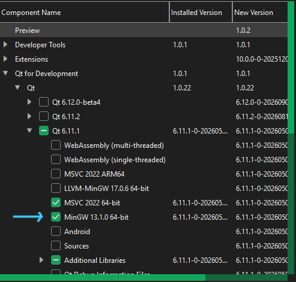
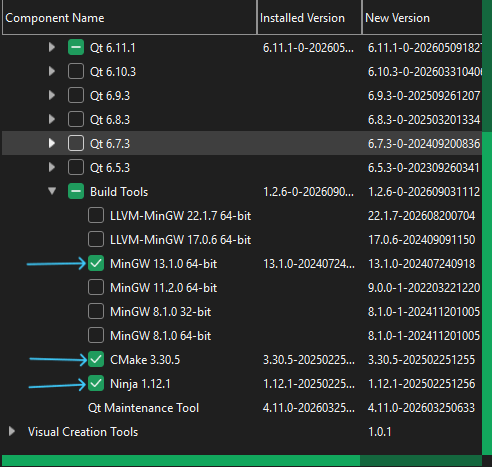

# Qt6CMakeTemplate
Minimal cross-platform Qt6 cmake setup, that can be used as a starting point for a Qt c++ project.

## Requirements

- Qt6 Development SDK + Mingw Toolchain
- CMake 3.22 or higher
- Build System: Ninja (recommended)

images below shows what pkgs to install using Qt online installer




## Project Structure
- this a minimal setup so we have only one root    ```CMakeLists.txt``` file, edit it to your liking, you can begin with changin the project name ```Qt6CMakeTemplate``` to your project name
- the project uses .env file in the root directory to configure the build you can change: 
    - ```QT_DIR```: Qt installation directory, example: C:/Qt/6.11.1/mingw_64 **MUST BE SET**
    - ```CMAKE_GENERATOR```: generator used by cmake, defaults to ninja
    - ```BUILD_DIR```: build directory, defaults to 'build'
    - ```INSTALL_DIR```: app installation directory, defaults to 'dist'
    - ```BUILD_TYPE```: build type, possible values: **Debug, Release, RelWithDebInfo, MinSizeRel**
    - ```BUILD_TESTING```: boolean to enable or disable tests, possible values: **ON, OFF**

- app version for c++ use is handled by cmake you can ```#include "Version.h"``` and access the app version by macros defined in ```cmake\Version.h.in```

- ```build.bat``` and ```build.sh``` are scripts made to automate the build and install process, using configuration from the ```.env``` file in the root directory

- a simple qt c++ app is written inside the ```main.cpp``` file to get you started

## Getting Started

Clone the repository
```bash
git clone https://github.com/username/project-name.git
cd project-name
```

Configure ```.env``` file in the root directory to your liking

if you use Windows run ```build.bat```, if you use linux run ```build.sh``` make sure to make it executable by running the command ```chmod +x build.sh``` 

if the build succeeds you should see a new directory with the name set to ```INSTALL_DIR``` in .env file if not set it will be 'dist', the executable will be located under ```dist/bin/``` packaged with all needed dependencies

## Tests
test filels avalible under the ```tests``` directoryif ```BUILD_TESTING``` set to true you can run test with the command
```bash
ctest --test-dir <build-dir> --output-on-failure
```
change <build-dir> to your build dir

## License

This project is licensed under the MIT license.

See [LICENSE](LICENSE) for more information.